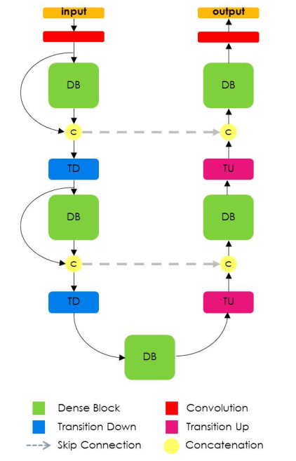
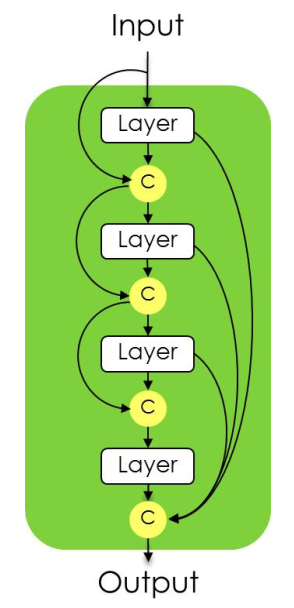
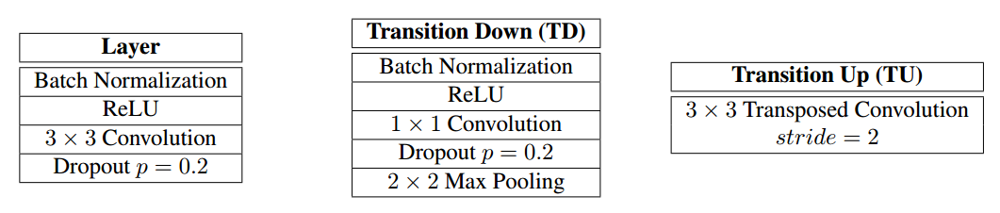
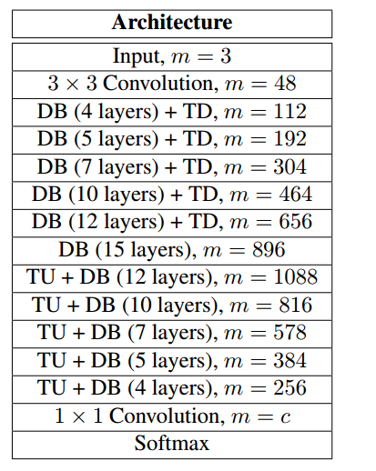

#The One Hundred Layers Tiramisu
Tensorflow 2 implementation of 
[The One Hundred Layers Tiramisu: Fully Convolutional DenseNets for Semantic Segmentation](https://arxiv.org/pdf/1611.09326.pdf)

This paper is build on top of the [Densely Connected Convolutional Networks](https://arxiv.org/pdf/1608.06993.pdf)

[Link](https://github.com/SimJeg/FC-DenseNet) to the original implementation by authors

##Architecture
This paper is build on top of the [Densely Connected Convolutional Neural Network](https://arxiv.org/pdf/1608.06993.pdf) 
paper which itself is inspired with ResNets.

The idea of DenseNets is based on the observation that if each layer is directly connected to every other layer in a
feed-forward fashion then the network will be more accurate and easier to train.

As the following figure depicts, like other classical DCNNs-based approach for semantic segmentation, Tiramisu also adopts a U-net based architecture,
including an Encoder (down sampling path), a Bottleneck and a Decoder (Up sampling path) and also it benefits skip connections as well.

Dense Blocks are shown in detail in the following figure:

Layers, TD, and TU blocks are defined as follow:

These three blocks are implemented in [layers](models/layer.py), [TD](models/TD_block.py) and [TU](models/TU_block.py), respectively
 using [subclass layering method](https://keras.io/guides/making_new_layers_and_models_via_subclassing/#the-layer-class-the-combination-of-state-weights-and-some-computation).
[Dense Blocks](models/dense_block.py) are also implemented by subclass layering method, while recursively composing [layers](models/layer.py).

Tiramisu is defined in three different versions:
* 56 layers (FC-DenseNet56), with 4 layers per dense block and a growth rate of 12
* 67 layers (FC-DenseNet67), with 5 layers per dense block and a growth rate of 16
* 103 layers (FC-DenseNet103) with 5 layers ped dense block and a growth rate k = 16 (see below for details).

